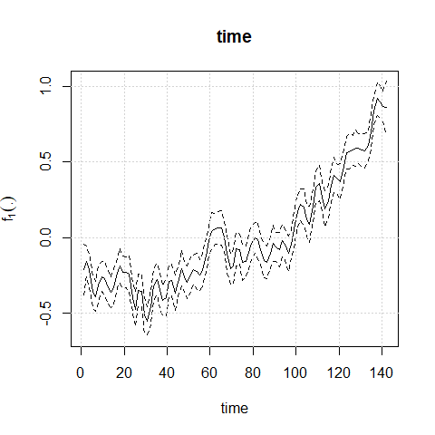

# aplms

The goal of `aplms` is fitting Additive partial linear models with
symmetric autoregressive errors (APLMS), proposed by [Chou-Chen et al.,
(2024)](https://doi.org/10.1007/s00362-024-01590-w). This framework
models a time series response variable using both linear and nonlinear
structures of a set of explanatory variables, with the nonparametric
components approximated by natural cubic splines or P-splines. It also
accounts for autoregressive error terms with distributions that have
lighter or heavier tails than the normal distribution.

## Installation

You can install the package with:

``` r
install.packages("aplms")
```

or the development version of aplms from [GitHub](https://github.com/)
with:

``` r
# install.packages("devtools")
devtools::install_github("shuwei325/aplms")
```

## Model

The details of the model and its assumptions are given in [Chou-Chen et
al., (2024)](https://doi.org/10.1007/s00362-024-01590-w).

## Example

This package provides two datasets to illustrate the model fitting
procedure. To load the package:

``` r
library(aplms)
```

### 1. Global annual mean surface air temperature

The first dataset `temperature`:

``` r
data(temperature)

# Create dataframe object to fit the model
datos = data.frame(temperature,time=1:length(temperature))

mod1<-aplms::aplms(temperature ~ 1,
                   npc=c("time"), basis=c("cr"),Knot=c(60),
                   data=datos,family=Powerexp(k=0.3),p=1,
                   control = list(tol = 0.001,
                                  algorithm1 = c("P-GAM"),
                                  algorithm2 = c("BFGS"),
                                  Maxiter1 = 20,
                                  Maxiter2 = 25),
                   lam=c(10))
```

``` r
summary(mod1)
#>  ---------------------------------------------------------------
#>  Additive partial linear models with symmetric errors 
#>  ---------------------------------------------------------------
#>  Sample size:  142 
#>  -------------------------- Model ---------------------------
#> 
#> aplms::aplms(formula = temperature ~ 1, npc = c("time"), basis = c("cr"), 
#>     Knot = c(60), data = datos, family = Powerexp(k = 0.3), p = 1, 
#>     control = list(tol = 0.001, algorithm1 = c("P-GAM"), algorithm2 = c("BFGS"), 
#>         Maxiter1 = 20, Maxiter2 = 25), lam = c(10))
#>  
#>  ------------------- Parametric component -------------------
#> 
#>           Estimate Std. Error t value  Pr(>|t|)    
#> intercept 0.056619     0.0041 13.8905 < 2.2e-16 ***
#> 
#>  ----------------- Non-parametric component ------------------ 
#> 
#>          Wald       df    Pr(>.)    
#> time 7589.838   58.583 < 2.2e-16 ***
#> 
#>  --------------- Autoregressive and Scale parameter ---------------- 
#> 
#>        Estimate Std. Error    Wald  Pr(>|t|)    
#> phi   0.0022992     0.0003  7.3902 1.242e-11 ***
#> rho1 -0.2571215     0.0662 -3.8866 0.0001568 ***
#>  
#> 
#> ------ Penalized Log-likelihood and Information criterion------
#> 
#>  Log-lik:  200.07 
#>  AIC    :  -276.97 
#>  AICc   :  -274.46 
#>  BIC    :  -94.94 
#>  GCV    :  0.01 
#> 
#>  --------------------------------------------------------------------
```

``` r
plot(mod1)
```



To perform diagnostic and influence analyses, execute:

``` r
aplms.diag.plot(mod1)
influenceplot.aplms(mod1,  perturbation = c("case-weight"))
```

### 2. Respiratory diseases

The second dataset `hospitalization`:

``` r
data(hospitalization)

mod2<-aplms::aplms(formula = y ~ 
              MP10_avg + NO_avg + O3_avg + TEMP_min + ampl_max + RH_max,
            npc=c("tdate","epi.week"), basis=c("cr","cc"),Knot=c(60,12),
            data=hospitalization,family=Powerexp(k=0.3),p=3,
            control = list(tol = 0.001,
                           algorithm1 = c("P-GAM"),
                           algorithm2 = c("BFGS"),
                           Maxiter1 = 20,
                           Maxiter2 = 25),
            lam=c(100,10))
```

``` r
summary(mod2)
#>  ---------------------------------------------------------------
#>  Additive partial linear models with symmetric errors 
#>  ---------------------------------------------------------------
#>  Sample size:  932 
#>  -------------------------- Model ---------------------------
#> 
#> aplms::aplms(formula = y ~ MP10_avg + NO_avg + O3_avg + TEMP_min + 
#>     ampl_max + RH_max, npc = c("tdate", "epi.week"), basis = c("cr", 
#>     "cc"), Knot = c(60, 12), data = hospitalization, family = Powerexp(k = 0.3), 
#>     p = 3, control = list(tol = 0.001, algorithm1 = c("P-GAM"), 
#>         algorithm2 = c("BFGS"), Maxiter1 = 20, Maxiter2 = 25), 
#>     lam = c(100, 10))
#>  
#>  ------------------- Parametric component -------------------
#> 
#>            Estimate Std. Error t value Pr(>|t|)    
#> intercept 83.317951    14.8082  5.6265 2.44e-08 ***
#> MP10_avg   0.276500     0.0673  4.1057 4.39e-05 ***
#> NO_avg    -0.071118     0.0909 -0.7821   0.4344    
#> O3_avg    -0.050675     0.0632 -0.8014   0.4231    
#> TEMP_min   0.073164     0.2201  0.3324   0.7397    
#> ampl_max  -0.174587     0.2640 -0.6613   0.5086    
#> RH_max    -0.071845     0.1382 -0.5199   0.6032    
#> 
#>  ----------------- Non-parametric component ------------------ 
#> 
#>             Wald      df    Pr(>.)    
#> tdate    13.8541  3.5398  0.005221 ** 
#> epi.week 16.9563  1.5178 9.978e-05 ***
#> 
#>  --------------- Autoregressive and Scale parameter ---------------- 
#> 
#>      Estimate Std. Error    Wald  Pr(>|t|)    
#> phi  96.19593     5.0808 18.9331 < 2.2e-16 ***
#> rho1  0.45783     0.0318 14.4155 < 2.2e-16 ***
#> rho2  0.23190     0.0345  6.7186 3.211e-11 ***
#> rho3  0.16820     0.0323  5.2017 2.434e-07 ***
#>  
#> 
#> ------ Penalized Log-likelihood and Information criterion------
#> 
#>  Log-lik:  -3706.73 
#>  AIC    :  7445.58 
#>  AICc   :  7446.61 
#>  BIC    :  7523.26 
#>  GCV    :  99.57 
#> 
#>  --------------------------------------------------------------------
```

``` r
plot(mod2)
```


To perform diagnostic and influence analyses, execute:

``` r
aplms.diag.plot(mod2)
influenceplot.aplms(mod2,  perturbation = c("case-weight"))
```
